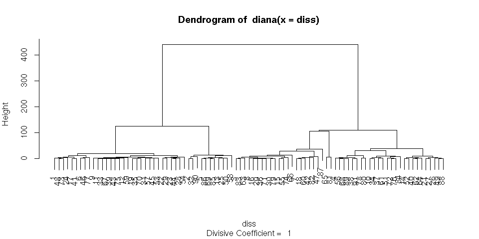
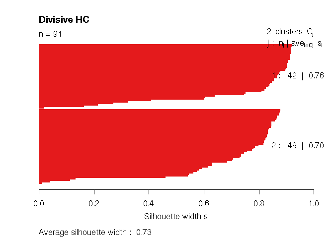
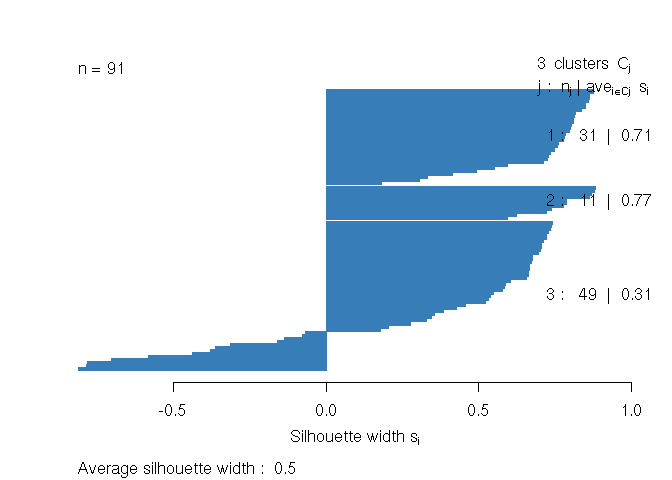
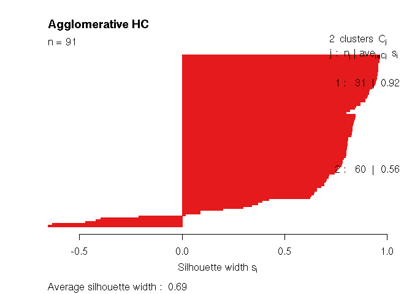
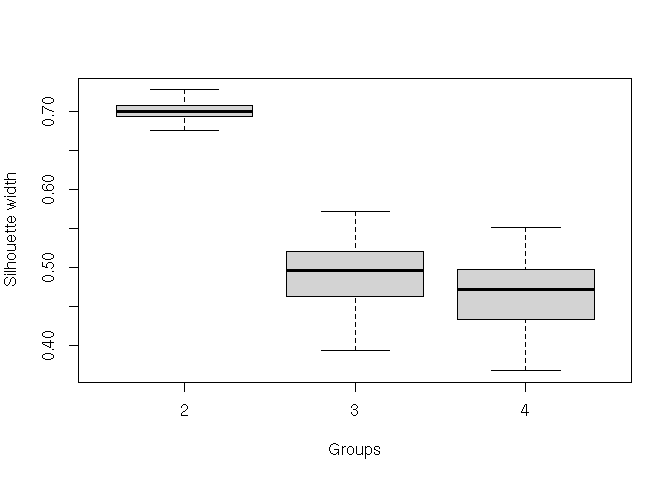

Multiple stellar populations in NGC 2808: a cluster analysis approach
================
Matteo Dell’Omodarme, Giada Valle. Emanuele Tognelli
2021-10-13

# Introduction

This document shows the results of the application of cluster analysis
methods for multiple populations (MPs) search in globular clusters. The
full analysis and the results can be found in Dell’Omodarme, Valle, and
Tognelli (2021); here we only report some of the main results and show
the use of the R functions to obtain them.

Dell’Omodarme, Valle, and Tognelli (2021) analysed two different data
set from Hong et al. (2021) and Carretta (2015). Both papers provide
abundances for NGC 2808 RGB stars. In the following we only show the
analysis of the former data set, the procedure for the second one being
identical.

The data set under examination contains measurements of spectral indexes
for CN, CH, and Ca II H&K lines (tracers of N, C, and Ca abundances,
respectively) from a sample of 91 RGB stars. To remove the effects of
gravity and temperature on these indexes, the authors de-trended them by
subtracting the mean value of the regression against the magnitude V
over the whole sample, obtaining the *δ*CN, *δ*CH, and *δ*HK’ indexes,
which we adopt in the present analysis.

# Preamble

Few R libraries are used during the analysis. The `cluster` library
contains the main functions; we use two hierarchical clustering (HC)
methods and a partitioning method. `MASS` is used to generate
multivariate Gaussian random variables for Monte Carlo resampling.
Optionally `RColorBrewer` can be use to pick an appropriate palette for
visualization.

``` r
library(cluster)
library(MASS)
library(RColorBrewer)

cols <- brewer.pal(n=4, "Set1")
```

The function `sq.dist` was used to define the distances between objects
in the abundances hyperspace, accounting for the measurement errors,

In detail, we defined **X** as the matrix of the *p* observed quantities
for the *n* objects under consideration. Let *x*<sub>*ij*</sub> be the
element of the *i*-th row and *j*-th column of **X**, and
*σ*<sub>*ij*</sub> its uncertainty. We computed the *n* × *n*
dissimilarity matrix for the *n* objects **D**, which is the matrix
whose elements *d*(*a*, *b*) are the squared euclidean distances between
rows *a* and *b* of **X**, weighted by their errors:

``` r
sq.dist <- function(d, s, sq=FALSE) {
    cols <- ncol(d)
    rows <- nrow(d)
    
    dist <- do.call(rbind, lapply(1:rows, function(i) {
        a <-  matrix(as.numeric(d[i,]), nrow=rows, ncol=cols, byrow=TRUE)
        b <-  matrix(as.numeric(s[i,]), nrow=rows, ncol=cols, byrow=TRUE)
    
        diff <- (d - a)^2
        sig <- s^2 + b^2
        dist <- rowSums(diff/sig) 
        return(dist)
    }))

    if(sq) dist <- sqrt(dist)
    return(dist)
}
```

By default the function returns the squared distances (`sq=FALSE`), to
better evidence sub structure in the data. While the qualitative results
did not change, it produces a clearer separation.

# Analysis

also adopted Low-resolution spectroscopy from (Hong et al. 2021) are
conveniently packaged in the `low.rda` file, containing both element
indexes (`d.low` object) and their uncertainties (`s.low`).

``` r
load("low.rda")
d.low[1:3,]
```

    ##      deltaCN deltaCH deltaHK
    ## [1,] -0.1645 -0.0019 -0.0649
    ## [2,]  0.0015  0.0179 -0.0290
    ## [3,]  0.1712 -0.0807  0.0184

As a first step we need to compute the dissimilarities between objects,
by using the `sq.dist` function:

``` r
diss <- as.dist(sq.dist(d.low, s.low))
```

The `diss` object can then be used to perform divisive HC (`diana`
function), and agglomerative HC (`agnes`):

``` r
dn <- diana(diss)
ag <- agnes(diss, method = "ward")
```

Here we adopt the Ward’s weighting, which minimizes the heterogeneity
within clusters (see e.g. Härdle and Simar 2012). The results of the
analyses are two dendrogram. The figure below shows the one from the
divisive approach:

``` r
plot(dn, which=2)
```

<!-- -->

The lower two object join, the higher their similarity. Cutting the tree
at different height one obtains different number of sub groups. The
silhouette plot helps comparing the performance of different cutting The
best sub setting is the one with the higher average silhouette width.
Here we compute the silhouette for 2,3, and 4 sub groups. The function
`cutree` cuts the tree specified as its first argument in the number of
sub groups specified as the second argument.

``` r
sil.dn.2 <- silhouette(cutree(dn, 2), diss)
sil.dn.3 <- silhouette(cutree(dn, 3), diss)
sil.dn.4 <- silhouette(cutree(dn, 4), diss)


sil.ag.2 <- silhouette(cutree(ag, 2), diss)
sil.ag.3 <- silhouette(cutree(ag, 3), diss)
sil.ag.4 <- silhouette(cutree(ag, 4), diss)
```

The silhouette plot can then be obtained calling the function `plot`.
The two, and three groups from divisive clustering, and the two groups
from agglomerative clustering are displayed.

``` r
plot(sil.dn.2, col=cols[1], border=cols[1], main="Divisive HC")
```

<!-- -->

``` r
plot(sil.dn.3, col=cols[2], border=cols[2], main="")
```

<!-- -->

``` r
plot(sil.ag.2, col=cols[1], border=cols[1], main="Agglomerative HC")
```

<!-- -->

Comparing the results presented in figures it is evident that the
average silhouette for the two groups split is much higher than that for
three groups.

Finally, the analysis is repeated adopting a partitioning method: PAM.
The two, three, and four groups aclustering re checked

``` r
pam2 <- pam(diss, 2)
pam3 <- pam(diss, 3)
pam4 <- pam(diss, 4)
```

The average silhouette from all the three tecniques for the tested sub
gruping can be collected toghether for ease of examination.

``` r
sm2 <- c(summary(sil.ag.2)$avg, summary(sil.dn.2)$avg, pam2$silinfo$avg)
sm3 <- c(summary(sil.ag.3)$avg, summary(sil.dn.3)$avg, pam3$silinfo$avg)
sm4 <- c(summary(sil.ag.4)$avg, summary(sil.dn.4)$avg, pam4$silinfo$avg)

SIL <- rbind(sm2,sm3,sm4)
colnames(SIL) <- c("Agnes", "Diana", "PAM")
rownames(SIL) <- 2:4
round(SIL, 2)
```

    ##   Agnes Diana  PAM
    ## 2  0.69  0.73 0.72
    ## 3  0.60  0.50 0.63
    ## 4  0.59  0.51 0.56

The two groups split performs better for all the techniques.

# Monte Carlo resampling

Tha analysis conducted so far only considers measurement errors in the
definition of the dissimilarity matrix. Recent methods to take them into
account in a cluster analysis were proposed in the literature. Here we
show a simple Monte Carlo (MC) resampling scheme, proposed by Su, Reedy,
and Carroll (2018), which has proven to be capable of reproducing the
clusters that would have been obtained with error-free variables.

The method consists in generating, for each row of **X**
(*x*<sub>*i*</sub>), *J* MC synthetic observations drawing them from
asymptotic error distribution. We adopt a multivariate Gaussian error
distribution with mean **0** and covariance matrix
**Σ** = diag(*σ*<sub>*i*</sub><sup>2</sup>). Here we use *J* = 1 to
investigate the variability of the average silhouette width due to
measurement errors.

``` r
nrun <- 50
nd <- nrow(d.low)

res <- do.call(rbind, lapply(1:nrun, function(i) {
    M <- do.call(rbind, lapply(1:nd, function(j) {
        SIG <- diag(as.numeric(s.low[j,]^2))
        mvrnorm(1, mu=as.numeric(d.low[j,]), Sigma=SIG)
    }))
    M <- as.matrix(M)
      
    diss <- as.dist(sq.dist(M, s.low))

    dn <- diana(diss)

    sil.dn.2 <- silhouette(cutree(dn, 2), diss)
    sil.dn.3 <- silhouette(cutree(dn, 3), diss)
    sil.dn.4 <- silhouette(cutree(dn, 4), diss)

    s2 <- summary(sil.dn.2)$avg.width
    s3 <- summary(sil.dn.3)$avg.width
    s4 <- summary(sil.dn.4)$avg.width

    return(c(s2,s3,s4))
}))
```

``` r
boxplot(res, outline=FALSE, names=2:4, xlab="Groups", ylab="Silhouette width")
```

<!-- -->

The boxplot shows that the two groups division is actually the best sub
setting even accounting for the data uncertainties.

# References

<div id="refs" class="references csl-bib-body hanging-indent">

<div id="ref-Carretta2015" class="csl-entry">

Carretta, E. 2015. “<span class="nocase">Five Groups of Red Giants with
Distinct Chemical Composition in the Globular Cluster NGC 2808</span>”
810 (2): 148. <https://doi.org/10.1088/0004-637X/810/2/148>.

</div>

<div id="ref-Valle2021" class="csl-entry">

Dell’Omodarme, M., G. Valle, and E. Tognelli. 2021. “Robust Statistical
Tools to Identify Multiple Stellar Populations in Globular Clusters in
Presence of Measurement Errors. A Case Study: NGC 2808.” *Submitted to
A&A*.

</div>

<div id="ref-simar" class="csl-entry">

Härdle, W. K., and L. Simar. 2012. *Applied Multivariate Statistical
Analysis*. Springer. <https://doi.org/10.1007/978-3-662-45171-7>.

</div>

<div id="ref-Hong2021" class="csl-entry">

Hong, S., D. Lim, C. Chung, J. Kim, S.-I. Han, and Y.-W. Lee. 2021.
“<span class="nocase">New sub-grouping of multiple stellar populations
in NGC 2808 based on low-resolution spectroscopy</span>.” *arXiv
e-Prints*, June, arXiv:2106.12583. <http://arxiv.org/abs/2106.12583>.

</div>

<div id="ref-Su2018" class="csl-entry">

Su, Y., J. Reedy, and R. J. Carroll. 2018. “Clustering in General
Measurement Error Models.” *Statistica Sinica* 28 (4): 2337–51.
<https://doi.org/10.5705/ss.202017.0093>.

</div>

</div>
